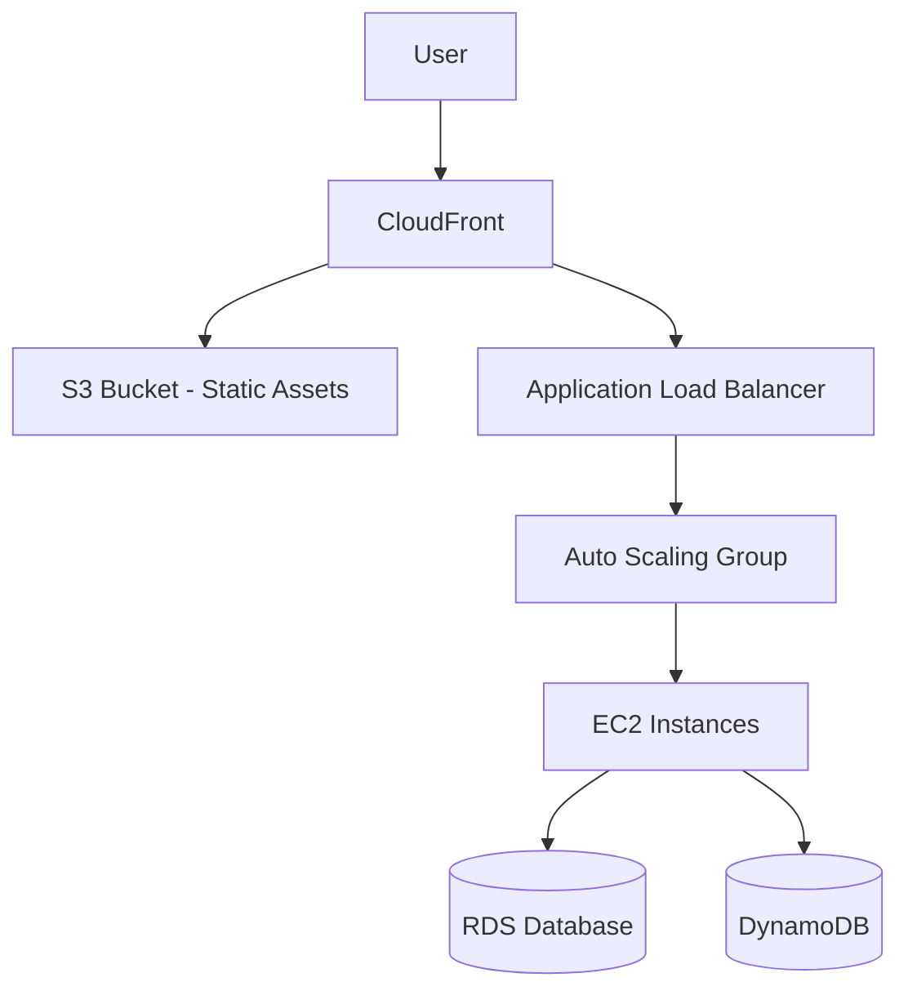

Amazon Web Services (AWS) is the world's most comprehensive and broadly adopted cloud platform, offering over 200 fully featured services from data centers globally.

### Architecture overview



### Core services deep dive

<Note>
  **Region Selection**: Always choose a region closest to your users to minimize latency and ensure compliance with local data residency laws.
</Note>

#### Compute
- **Amazon EC2**: Virtual servers in the cloud.
- **AWS Lambda**: Serverless functions that run in response to events.
- **Amazon ECS/EKS**: Container orchestration (Docker/Kubernetes).

#### Storage & Database
- **Amazon S3**: Scalable object storage for any data type.
- **Amazon RDS**: Managed relational database (MySQL, Postgres, Aurora).
- **Amazon DynamoDB**: Key-value and document NoSQL database.

### Common CLI commands 💻

```bash
# List S3 buckets
aws s3 ls

# Sync local directory to S3
aws s3 sync ./dist s3://my-static-site-bucket/ --delete

# Describe EC2 instances with filtering
aws ec2 describe-instances --filters "Name=instance-state-name,Values=running"
```

### Infrastructure as code (Terraform)

```hcl
resource "aws_s3_bucket" "example" {
  bucket = "my-tf-test-bucket"
  tags = {
    Name        = "My bucket"
    Environment = "Dev"
  }
}
```

### Best practices & tips 💡

<Check>
  **Enable MFA**: Secure your root account and IAM users with Multi-Factor Authentication.
</Check>

<Warning>
  **Principle of Least Privilege**: Grant only the minimum permissions required for a user or service to perform its task via IAM policies.
</Warning>

<Tip>
  **Cost Explorer**: Regularly review your AWS Cost Explorer to identify unexpected spikes and optimize resource allocation.
</Tip>

<Accordion title="Well-Architected Framework Pillars">
  1. **Operational Excellence**: Run and monitor systems.
  2. **Security**: Protect information and systems.
  3. **Reliability**: Recover from infrastructure or service disruptions.
  4. **Performance Efficiency**: Use computing resources efficiently.
  5. **Cost Optimization**: Avoid unnecessary costs.
  6. **Sustainability**: Minimize the environmental impacts of running cloud workloads.
</Accordion>
