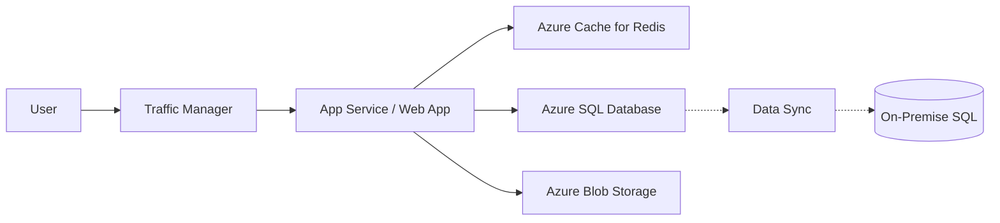

Microsoft Azure is a cloud computing service for application management via Microsoft-managed data centers.

### Enterprise Architecture



### Key Service Categories

| Category | Service Name | Purpose |
| :--- | :--- | :--- |
| **Identity** | Microsoft Entra ID | Modern identity and access management. |
| **Compute** | Azure App Service | Managed hosting for web apps and APIs. |
| **Compute** | Azure Kubernetes (AKS) | Managed Kubernetes orchestration. |
| **Database** | Azure Cosmos DB | Multi-model NoSQL with global replication. |
| **DevOps** | Azure DevOps | Boards, Repos, and Pipelines for CI/CD. |

### Infrastructure as Code (Bicep)

Bicep is a domain-specific language (DSL) that uses declarative syntax to deploy Azure resources.

```bicep
resource storageAccount 'Microsoft.Storage/storageAccounts@2022-09-01' = {
  name: 'mystorageaccount'
  location: 'eastus'
  sku: {
    name: 'Standard_LRS'
  }
  kind: 'StorageV2'
}
```

### Useful Azure CLI Commands 💻

```bash
# Login to Azure
az login

# List resource groups in a table format
az group list --output table

# Create a resource group
az group create --name MyResourceGroup --location eastus

# Deploy resources using Bicep
az deployment group create --resource-group MyResourceGroup --template-file main.bicep
```

### Pro Tips 💡

<Check>
  **Use Resource Groups**: Organize your resources into logical containers for life-cycle management and billing.
</Check>

<Tip>
  **Azure Advisor**: Use Azure Advisor for automated recommendations on high availability, security, performance, and cost.
</Tip>

<Accordion title="Enterprise Hybrid Integration">
  Azure specializes in hybrid cloud scenarios using **Azure Arc** to manage servers across on-premises, edge, and multi-cloud environments from a single control plane.
</Accordion>

<Note>
  Azure Active Directory has been rebranded to **Microsoft Entra ID**.
</Note>
