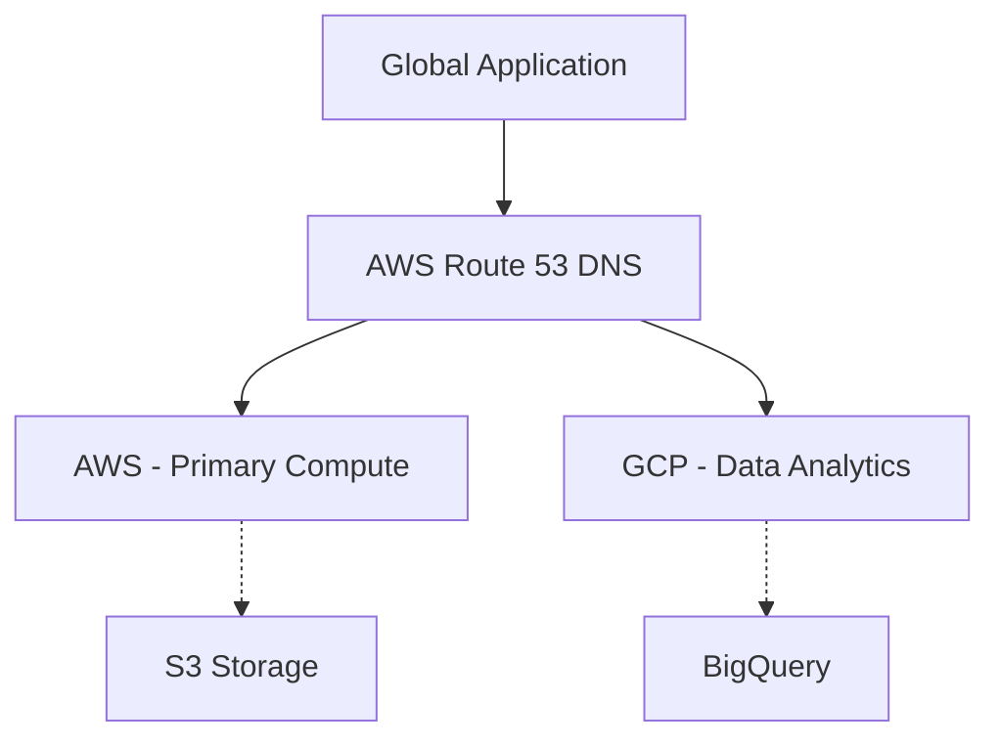

Choosing the right cloud provider can be challenging. This guide maps core services between the "Big Three" providers to help you translate your knowledge.

### Service Mapping Table

| Service Category | AWS | Azure | Google Cloud (GCP) |
| :--- | :--- | :--- | :--- |
| **Compute** | EC2 | Virtual Machines | Compute Engine |
| **Serverless** | Lambda | Azure Functions | Cloud Functions |
| **Containers** | ECS / EKS | Container Instances / AKS | GKE |
| **Object Storage** | S3 | Blob Storage | Cloud Storage |
| **Relational DB** | RDS | Azure SQL | Cloud SQL |
| **NoSQL DB** | DynamoDB | Cosmos DB | Cloud Bigtable / Firestore |
| **Networking** | VPC | Virtual Network | VPC |
| **DNS** | Route 53 | Azure DNS | Cloud DNS |
| **IaC** | CloudFormation | Bicep / ARM | Deployment Manager |

### How to Choose?

- **AWS**: The market leader with the most extensive service catalog and mature ecosystem. Best for massive scale and complex needs.
- **Azure**: Best for organizations already heavily invested in Microsoft technology (Active Directory, Office 365, Windows Server).
- **GCP**: Known for best-in-class data analytics, machine learning, and Kubernetes support. Often favored by startups and data-heavy companies.

### Multi-Cloud Strategy

Many enterprises adopt a multi-cloud strategy to avoid vendor lock-in and leverage the "best of breed" services from each provider.

### Cost Comparison Tips 💸

<Tip>
  All providers offer a **Free Tier** with limited resources for a certain period. Use them to experiment before committing to paid resources.
</Tip>

<Check>
  Use each provider's **Pricing Calculator** to estimate costs for your specific architecture:
  - [AWS Calculator](https://calculator.aws/)
  - [Azure Calculator](https://azure.microsoft.com/en-us/pricing/calculator/)
  - [GCP Calculator](https://cloud.google.com/products/calculator)
</Check>

<Note>
  While each provider has its own proprietary IaC (Infrastructure as Code) tool, **Terraform** is the industry standard for multi-cloud deployments.
</Note>
