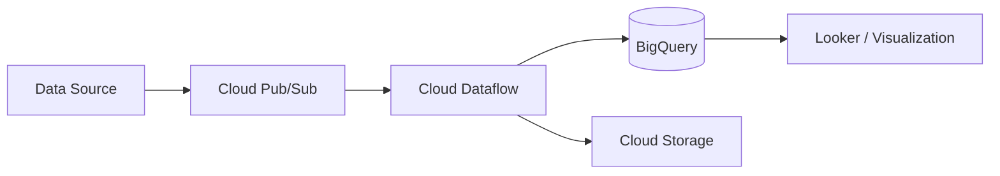

Google Cloud Platform (GCP) is a suite of cloud computing services that runs on the same infrastructure that Google uses internally for its end-user products.

### Data Engineering Architecture



### Specialized GCP Services

| Category | Service | Why use it? |
| :--- | :--- | :--- |
| **Data Warehouse** | BigQuery | Lightning fast SQL queries on petabytes of data. |
| **Kubernetes** | GKE | The most mature managed Kubernetes service. |
| **Serverless** | Cloud Run | Run any container as a serverless service. |
| **AI / ML** | Vertex AI | Unified platform for training and deploying ML models. |
| **NoSQL** | Firestore | Real-time document database for mobile and web. |

### Useful `gcloud` Commands 💻

```bash
# List all projects
gcloud projects list

# Set the current working project
gcloud config set project [PROJECT_ID]

# Create a Cloud Run service from source
gcloud run deploy my-service --source .

# View logs for a specific service
gcloud logging read "resource.type=cloud_run_revision AND resource.labels.service_name=my-service"
```

### Google's Global Network 🌐

GCP is known for its **Premium Tier** network, which uses Google's private fiber-optic cable network to transport data between users and resources, reducing latency and increasing security.

### Quick Start Tips

<Tip>
  **Cloud Shell**: Use the built-in Cloud Shell in the console for a free, pre-configured ephemeral VM with all tools pre-installed.
</Tip>

<Check>
  **Projects & Folders**: Use folders to organize projects for different departments or environments (Dev/Prod) to apply centralized IAM policies.
</Check>

<Accordion title="Identity-Aware Proxy (IAP)">
  IAP lets you manage access to applications running on GCP without using a VPN. It uses identity and context to guard the application's entrance.
</Accordion>

<Note>
  Everything in GCP is organized into **Projects**. All resources must belong to a project, and billing is typically enabled at the project level.
</Note>
