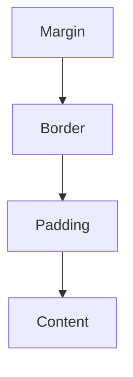

CSS is used to style and layout web pages — for example, to alter the font, color, size, and spacing of your content.

### The Box Model



### Selector Specificity

Specificity is the algorithm used by browsers to determine which CSS declaration is applied to an element.

| Selector Type | Example | Specificity Score |
| :--- | :--- | :--- |
| **Inline Styles** | `style="..."` | 1,0,0,0 |
| **ID** | `#header` | 0,1,0,0 |
| **Class/Attribute/Pseudo** | `.btn`, `[type="text"]` | 0,0,1,0 |
| **Element/Pseudo-element** | `div`, `::before` | 0,0,0,1 |
| **Universal Selector** | `*` | 0,0,0,0 |

### Layout Engines

#### Flexbox (One-Dimensional)
Best for aligning items in a single row or column.

```css
.flex-container {
  display: flex;
  justify-content: space-between; /* Horizontal spacing */
  align-items: center;            /* Vertical alignment */
  gap: 1rem;
}
```

#### CSS Grid (Two-Dimensional)
Best for complex layouts with both rows and columns.

```css
.grid-container {
  display: grid;
  grid-template-columns: repeat(auto-fit, minmax(200px, 1fr));
  grid-template-rows: auto;
  gap: 20px;
}
```

### Modern CSS Techniques

#### Container Queries
Style elements based on the size of their container rather than the viewport.

```css
.card-container {
  container-type: inline-size;
}

@container (min-width: 400px) {
  .card {
    display: flex;
    flex-direction: row;
  }
}
```

#### Responsive Design (Media Queries)
Adjust styles based on device characteristics like screen width.

```css
@media (max-width: 768px) {
  .sidebar {
    display: none;
  }
  .main-content {
    width: 100%;
  }
}
```

### Pro Styling Tips 🎨

<Tip>
  **Custom Properties (Variables)**: Use CSS variables for consistent colors and spacing across your site.
  ```css
  :root {
    --primary-color: #3884FF;
    --spacing-base: 8px;
  }
  ```
</Tip>

<Accordion title="Centering a Div">
  The modern, one-liner way to center everything in a container:
  ```css
  .center-me {
    display: grid;
    place-items: center;
  }
  ```
</Accordion>

<Note>
  The **Box Model** consists of Margin, Border, Padding, and Content. Use `box-sizing: border-box;` globally to include padding and border in the element's total width and height calculation.
</Note>
