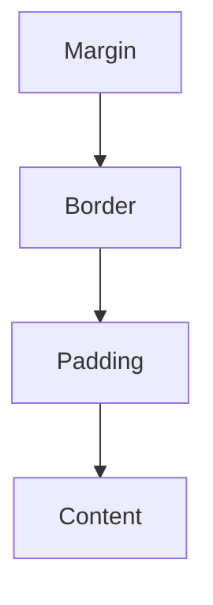

CSS is used to style and layout web pages — for example, to alter the font, color, size, and spacing of your content.

### The Box Model



### Selector Specificity

Specificity is the algorithm used by browsers to determine which CSS declaration is applied to an element.

| Selector Type | Example | Specificity Score |
| :--- | :--- | :--- |
| **Inline Styles** | `style="..."` | 1,0,0,0 |
| **ID** | `#header` | 0,1,0,0 |
| **Class/Attribute/Pseudo** | `.btn`, `[type="text"]` | 0,0,1,0 |
| **Element/Pseudo-element** | `div`, `::before` | 0,0,0,1 |
| **Universal Selector** | `*` | 0,0,0,0 |

### Flexbox vs. Grid Cheatsheet

| Feature | Flexbox (1D) | Grid (2D) |
| :--- | :--- | :--- |
| **Primary Axis** | Row OR Column | Row AND Column |
| **Alignment** | Content-driven | Layout-driven |
| **Best For** | Component alignment | Overall page layout |

#### Quick Flexbox Setup
```css
.container {
  display: flex;
  justify-content: center; /* horizontal */
  align-items: center;     /* vertical */
}
```

#### Quick Grid Setup
```css
.container {
  display: grid;
  grid-template-columns: repeat(3, 1fr);
  gap: 20px;
}
```

### Pro Styling Tips 🎨

<Tip>
  **Custom Properties (Variables)**: Use CSS variables for consistent colors and spacing.
  `--primary-color: #166E3F;`
</Tip>

<Accordion title="Centering a Div">
  The modern way to center everything in a container:
  ```css
  .center-me {
    display: grid;
    place-items: center;
  }
  ```
</Accordion>

<Note>
  The **Box Model** consists of Margin, Border, Padding, and Content. Use `box-sizing: border-box;` to include padding and border in the element's total width and height.
</Note>
