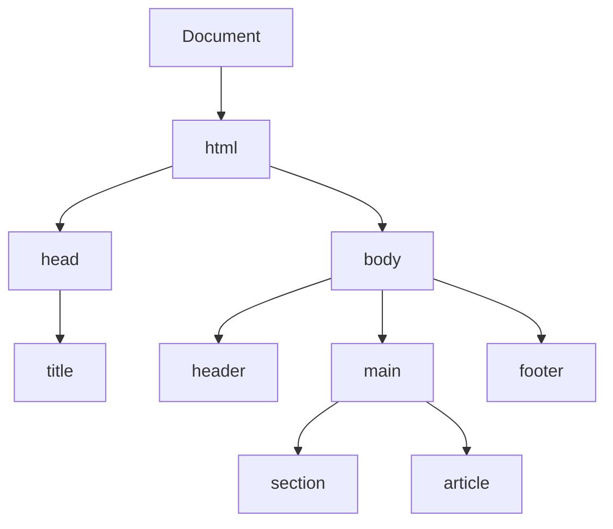

HTML (HyperText Markup Language) is the backbone of the web. It provides the structure for web pages.

### DOM Tree Structure



### Semantic HTML Reference

Using semantic elements helps search engines and accessibility tools understand your content.

| Element | Description |
| :--- | :--- |
| `<header>` | Introductory content or set of navigational links. |
| `<nav>` | A section intended for navigation links. |
| `<main>` | The dominant content of the `<body>`. |
| `<article>` | Self-contained composition in a document. |
| `<section>` | A generic standalone section of a document. |
| `<aside>` | Content indirectly related to the main content. |
| `<footer>` | Content at the end of a section or page. |

### Advanced HTML Structures

#### Forms and Validation
Forms are essential for collecting user input. Use native HTML5 validation for immediate feedback.

```html
<form action="/submit" method="POST">
  <label for="email">Email:</label>
  <input type="email" id="email" name="email" required placeholder="user@example.com">

  <label for="password">Password:</label>
  <input type="password" id="password" name="password" minlength="8" required>

  <button type="submit">Register</button>
</form>
```

#### Responsive Images
Use the `srcset` attribute to serve different image sizes based on device resolution.

```html

```

### Common Elements Cheat Sheet

```html
<!-- Links -->
<a href="https://example.com" target="_blank" rel="noopener">Visit Example</a>

<!-- Lists -->
<ul>
  <li>Unordered item</li>
</ul>
<ol>
  <li>Ordered item</li>
</ol>

<!-- Tables -->
<table>
  <thead>
    <tr><th>Name</th><th>Role</th></tr>
  </thead>
  <tbody>
    <tr><td>Alice</td><td>Engineer</td></tr>
  </tbody>
</table>
```

### Accessibility Tips ♿

<Tip>
  **Alt Text**: Always provide meaningful `alt` text for images to assist screen reader users. Use `alt=""` for purely decorative images.
</Tip>

<Check>
  **Use Buttons for Actions**: Use `<button>` for actions and `<a>` for navigation. This ensures proper keyboard interaction and role mapping.
</Check>

<Note>
  Ensure your HTML has a logical heading structure (`h1` through `h6`) to help users navigate your content. Avoid skipping levels (e.g., `h1` directly to `h3`).
</Note>
