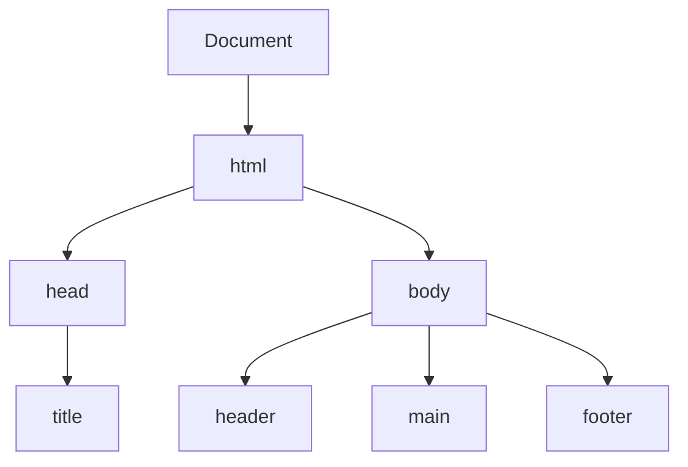

HTML (HyperText Markup Language) is the backbone of the web. It provides the structure for web pages.

### DOM Tree Structure



### Semantic HTML Reference

Using semantic elements helps search engines and accessibility tools understand your content.

| Element | Description |
| :--- | :--- |
| `<header>` | Introductory content or set of navigational links. |
| `<nav>` | A section intended for navigation links. |
| `<main>` | The dominant content of the `<body>`. |
| `<article>` | Self-contained composition in a document. |
| `<section>` | A generic standalone section of a document. |
| `<footer>` | Content at the end of a section or page. |

### Common Elements Cheat Sheet

```html
<!-- Links -->
<a href="https://example.com">Visit Example</a>

<!-- Images -->


<!-- Lists -->
<ul>
  <li>Unordered item</li>
</ul>
<ol>
  <li>Ordered item</li>
</ol>
```

### Accessibility Tips ♿

<Tip>
  **Alt Text**: Always provide meaningful `alt` text for images to assist screen reader users.
</Tip>

<Check>
  **Use Buttons for Actions**: Use `<button>` for actions and `<a>` for navigation. This ensures proper keyboard interaction and role mapping.
</Check>

<Note>
  Ensure your HTML has a logical heading structure (`h1` through `h6`) to help users navigate your content.
</Note>
