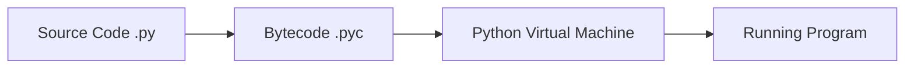

Python is a high-level, interpreted, general-purpose programming language. Its design philosophy emphasizes code readability with the use of significant indentation.

### Execution Flow



### Data Types Overview

| Category | Type | Description | Example |
| :--- | :--- | :--- | :--- |
| **Numeric** | `int`, `float`, `complex` | Whole numbers, decimals, complex numbers | `42`, `3.14`, `1j` |
| **Sequence** | `list`, `tuple`, `range` | Ordered collections of items | `[1, 2]`, `(3, 4)`, `range(5)` |
| **Text** | `str` | Unicode character strings | `"Hello Python"` |
| **Mapping** | `dict` | Key-value pairs | `{"id": 1}` |
| **Set** | `set`, `frozenset` | Unordered collections of unique items | `{1, 2, 3}` |
| **Boolean** | `bool` | Truth values | `True`, `False` |

### Python Cheat Sheet

#### Common List Methods
- `.append(x)`: Adds an item to the end.
- `.extend(iterable)`: Appends all items from an iterable.
- `.pop([i])`: Removes and returns the item at the given position.
- `.sort()`: Sorts the list in place.

#### Dictionary Methods
- `.keys()`: Returns a view of dictionary keys.
- `.values()`: Returns a view of dictionary values.
- `.get(key, default)`: Returns the value for key if key is in the dictionary.

### Tips & Tricks 💡

<Tip>
  **List Comprehensions**: A concise way to create lists.
  `[x**2 for x in range(10) if x % 2 == 0]`
</Tip>

<Accordion title="String Formatting (f-strings)">
  F-strings provide a concise and convenient way to embed expressions inside string literals.
  ```python
  name = "World"
  print(f"Hello, {name}!")
  ```
</Accordion>

<Note>
  Python uses indentation to define code blocks, unlike many other languages that use curly braces `{}`.
</Note>
