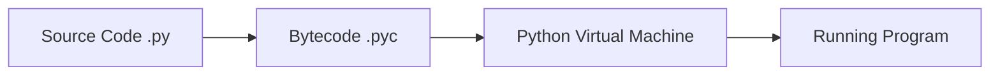
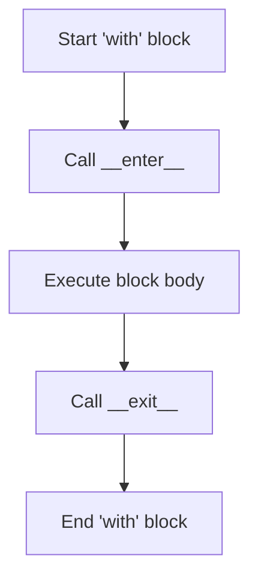

Python is a high-level, interpreted, general-purpose programming language. Its design philosophy emphasizes code readability with the use of significant indentation.

### Execution Flow



### Data Types Overview

| Category | Type | Description | Example |
| :--- | :--- | :--- | :--- |
| **Numeric** | `int`, `float`, `complex` | Whole numbers, decimals, complex numbers | `42`, `3.14`, `1j` |
| **Sequence** | `list`, `tuple`, `range` | Ordered collections of items | `[1, 2]`, `(3, 4)`, `range(5)` |
| **Text** | `str` | Unicode character strings | `"Hello Python"` |
| **Mapping** | `dict` | Key-value pairs | `{"id": 1}` |
| **Set** | `set`, `frozenset` | Unordered collections of unique items | `{1, 2, 3}` |
| **Boolean** | `bool` | Truth values | `True`, `False` |

### Advanced concepts 🚀

#### Decorators
Decorators are a powerful tool in Python that allows you to modify the behavior of a function or class without permanently modifying it.

```python
def my_decorator(func):
    def wrapper():
        print("Something is happening before the function is called.")
        func()
        print("Something is happening after the function is called.")
    return wrapper

@my_decorator
def say_hello():
    print("Hello!")

say_hello()
```

#### Context Managers
Context managers allow you to allocate and release resources precisely when you want to. The most common use case is the `with` statement.



```python
with open('test.txt', 'w') as f:
    f.write('Hello, World!')
# File is automatically closed here
```

#### Type Hinting
Type hints allow you to specify the expected types of variables, function parameters, and return values, improving code clarity and enabling better IDE support.

```python
from typing import List, Optional

def greet_users(names: List[str], greeting: Optional[str] = "Hello") -> None:
    for name in names:
        print(f"{greeting}, {name}!")

greet_users(["Alice", "Bob"])
```

#### Asynchronous Programming
Python's `asyncio` library is used to write concurrent code using the `async/await` syntax.

```python
import asyncio

async def fetch_data():
    print("Start fetching...")
    await asyncio.sleep(2)
    print("Done fetching!")
    return {"data": 123}

async def main():
    result = await fetch_data()
    print(result)

asyncio.run(main())
```

### Python Cheat Sheet

#### Common List Methods
- `.append(x)`: Adds an item to the end.
- `.extend(iterable)`: Appends all items from an iterable.
- `.pop([i])`: Removes and returns the item at the given position.
- `.sort()`: Sorts the list in place.

#### Dictionary Methods
- `.keys()`: Returns a view of dictionary keys.
- `.values()`: Returns a view of dictionary values.
- `.get(key, default)`: Returns the value for key if key is in the dictionary.

### Python Ecosystem & Frameworks 🌍

Explore specialized Python libraries and frameworks for web development and data science.

<CardGroup cols={2}>
  <Card title="Django" icon="browser" href="/languages/django" className="expressive-card">
    <div className="flex flex-col gap-3">
      <div className="flex gap-2">
        <span className="pill pill-primary">Web</span>
        <span className="pill pill-red">Security</span>
      </div>
      <p>High-level framework for building secure and maintainable web applications.</p>
    </div>
  </Card>
  <Card title="Data Science" icon="chart-simple" href="/languages/data-science" className="expressive-card">
    <div className="flex flex-col gap-3">
      <div className="flex gap-2">
        <span className="pill pill-green">Pandas</span>
        <span className="pill pill-orange">NumPy</span>
      </div>
      <p>Advanced data analysis and visualization with the Python data stack.</p>
    </div>
  </Card>
  <Card title="Interactive Notebooks" icon="book-open" href="/languages/notebooks" className="expressive-card">
    <div className="flex flex-col gap-3">
      <div className="flex gap-2">
        <span className="pill pill-purple">Jupyter</span>
        <span className="pill pill-blue">Colab</span>
      </div>
      <p>Master collaborative workflows and interactive analysis techniques.</p>
    </div>
  </Card>
</CardGroup>

### Tips & Tricks 💡

<Tip>
  **List Comprehensions**: A concise way to create lists.
  `[x**2 for x in range(10) if x % 2 == 0]`
</Tip>

<Accordion title="String Formatting (f-strings)">
  F-strings provide a concise and convenient way to embed expressions inside string literals.
  ```python
  name = "World"
  print(f"Hello, {name}!")
  ```
</Accordion>

<Note>
  Python uses indentation to define code blocks, unlike many other languages that use curly braces `{}`.
</Note>
