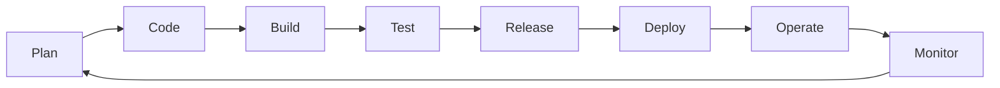

DevOps is a set of practices that combines software development (Dev) and IT operations (Ops). It aims to shorten the systems development life cycle and provide continuous delivery with high software quality.

## The DevOps Lifecycle

## Core Principles

### 1. Continuous Integration & Continuous Deployment (CI/CD)
Automate the process of merging code changes and deploying them to production.
- **CI**: Frequent code merges, automated builds, and testing.
- **CD**: Automated delivery to staging and/or production environments.

### 2. Infrastructure as Code (IaC)
Manage and provision infrastructure through machine-readable definition files (e.g., Terraform, Ansible, Bicep).

### 3. Site Reliability Engineering (SRE)
A discipline that incorporates aspects of software engineering and applies them to infrastructure and operations problems.
- **SLAs (Service Level Agreements)**: Commitments to users.
- **SLOs (Service Level Objectives)**: Internal goals.
- **SLIs (Service Level Indicators)**: Real-time measurements.

## Monitoring & Observability

Effective DevOps requires deep visibility into your systems.

| Concept | Description | Tools |
| :--- | :--- | :--- |
| **Metrics** | Quantitative data about resource usage. | Prometheus, Datadog |
| **Logging** | Discrete events that happen within an app. | ELK Stack, Splunk |
| **Tracing** | Following a request across microservices. | Jaeger, Honeycomb |

## Step-by-Step: Setting Up a Basic Pipeline

1.  **Source Control**: Host your code on GitHub, GitLab, or Bitbucket.
2.  **Build Automation**: Use a tool like GitHub Actions to compile code and run unit tests on every push.
3.  **Artifact Management**: Store your build artifacts (e.g., Docker images) in a private registry.
4.  **Deployment**: Automate the rollout to a cloud provider using IaC.

<Check>
  **Automate Everything**: If you have to do it twice, automate it. This reduces human error and ensures consistency.
</Check>

<Note>
  DevOps is as much about **culture** (collaboration, transparency, and shared responsibility) as it is about tools.
</Note>
