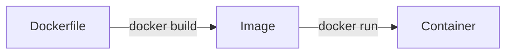

Docker is an open platform for developing, shipping, and running applications. Docker enables you to separate your applications from your infrastructure so you can deliver software quickly.

### Docker Lifecycle



### Docker CLI Command Reference

| Command | Description |
| :--- | :--- |
| `docker build` | Build an image from a Dockerfile. |
| `docker run` | Run a command in a new container. |
| `docker ps` | List running containers. |
| `docker images` | List available images. |
| `docker exec` | Run a command in a running container. |
| `docker stop` | Stop one or more running containers. |
| `docker rm` | Remove one or more containers. |

### Dockerfile Best Practices 🏗️

| Practice | Why? |
| :--- | :--- |
| **Use Small Base Images** | Reduces attack surface and download time (e.g., use `alpine`). |
| **Leverage Build Cache** | Order commands from least to most frequent changes. |
| **One Process per Container** | Simplifies scaling and monitoring. |
| **Use .dockerignore** | Avoid including unnecessary files in the image. |

### Example Optimized Dockerfile

```dockerfile
# Use a slim base image
FROM node:18-alpine

# Set working directory
WORKDIR /app

# Copy package files first (better caching)
COPY package*.json ./

# Install dependencies
RUN npm install --production

# Copy the rest of the application
COPY . .

# Run the app
CMD ["npm", "start"]
```

### Pro Tips 💡

<Tip>
  **Docker Desktop Dashboard**: Use the GUI to easily view logs and manage resources if you're not comfortable with the CLI yet.
</Tip>

<Check>
  **Multi-stage Builds**: Use multi-stage builds to keep your final image size as small as possible by only including what's needed for production.
</Check>

<Note>
  Containers are **ephemeral**. Always use **Volumes** for persistent data (like databases).
</Note>
