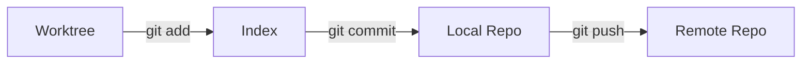

Git is a free and open source distributed version control system designed to handle everything from small to very large projects with speed and efficiency.

### Git Workflow



### Git Cheat Sheet

#### Basic Commands
```bash
git status                # View current state
git diff                  # See changes not yet staged
git log --oneline         # View commit history
```

#### Advanced Commands
```bash
git checkout -b new-branch # Create and switch to a new branch
git merge feature-branch   # Merge feature-branch into current
git rebase main            # Rebase current branch onto main
git cherry-pick [hash]     # Apply a specific commit
```

### Common Git Fixes (Undo) 🛠️

<Accordion title="Undo the last commit (keep changes)">
  ```bash
  git reset --soft HEAD~1
  ```
</Accordion>

<Accordion title="Change the last commit message">
  ```bash
  git commit --amend -m "New message"
</Accordion>

<Accordion title="Discard all local changes">
  ```bash
  git reset --hard HEAD
  ```
</Accordion>

### Best Practices 🚀

<Check>
  **Commit Often, Perfect Later**: Make small, frequent commits to track your progress.
</Check>

<Tip>
  **Write Meaningful Messages**: Explain *why* you made a change, not just *what* you changed.
</Tip>

<Warning>
  **Never Force Push to Main**: Always use Pull Requests and code reviews for shared branches.
</Warning>
