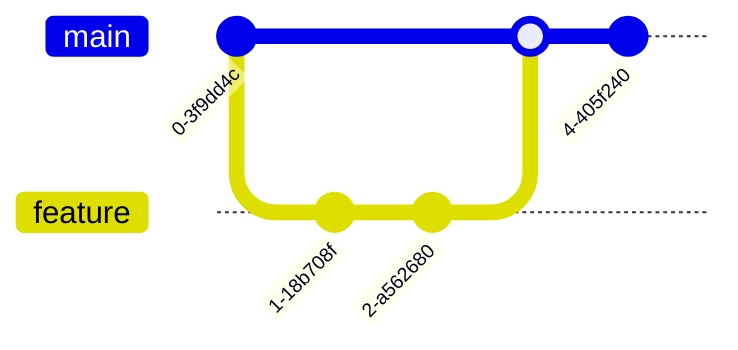

Git is a free and open source distributed version control system designed to handle everything from small to very large projects with speed and efficiency.

### Git Workflow


### Branching Strategies

#### Trunk-Based Development
Developers collaborate on code in a single branch called ‘trunk’ (usually `main`), and resist any pressure to create other long-lived development branches.



#### Gitflow
A legacy branching model that involves the use of feature branches and multiple primary branches (e.g., `develop`, `release`, `hotfix`).

### Advanced workflows 🌪️

#### Git stash
Use `git stash` to temporarily shelve (or stash) changes you've made to your working copy so you can work on something else, and then come back and re-apply them later.

```bash
git stash          # Stash current changes
git stash list     # See all stashed changes
git stash pop      # Apply the last stash and remove it from the list
```

#### Interactive Rebase
Interactive rebasing allows you to modify commits as they are being moved to a new base. This is great for cleaning up your history before merging a PR.

```bash
git rebase -i HEAD~3 # Interactively rebase the last 3 commits
```
Common interactive commands:
- `pick`: keep the commit
- `reword`: keep the commit, but edit the message
- `edit`: keep the commit, but stop for amending
- `squash`: meld into previous commit

### Git cheat sheet

#### Basic commands
```bash
git status                # View current state
git diff                  # See changes not yet staged
git log --oneline --graph # View commit history as a graph
```

#### Advanced commands
```bash
git checkout -b new-branch # Create and switch to a new branch
git merge feature-branch   # Merge feature-branch into current
git rebase main            # Rebase current branch onto main
git cherry-pick [hash]     # Apply a specific commit from another branch
```

### Common Git Fixes (Undo) 🛠️

<Accordion title="Undo the last commit (keep changes staged)">
  ```bash
  git reset --soft HEAD~1
  ```
</Accordion>

<Accordion title="Change the last commit message">
  ```bash
  git commit --amend -m "New message"
  ```
</Accordion>

<Accordion title="Discard all local changes (destructive)">
  ```bash
  git reset --hard HEAD
  ```
</Accordion>

<Warning>
  **Dangerous Operation**: `git reset --hard` will permanently delete all uncommitted changes in your working directory. Use it with extreme caution!
</Warning>

### Best practices 🚀

<Tip>
  **Git Aliases**: Speed up your workflow by creating shortcuts for common commands.
  `git config --global alias.co checkout`
</Tip>

<Check>
  **Commit Often, Perfect Later**: Make small, frequent commits to track your progress and make debugging easier.
</Check>

<Tip>
  **Write Meaningful Messages**: Explain *why* you made a change, not just *what* you changed. Use the imperative mood (e.g., "Fix bug" instead of "Fixed bug").
</Tip>

<Warning>
  **Never Force Push to Shared Branches**: Always use Pull Requests and code reviews. If you must force push to your own feature branch, use `--force-with-lease`.
</Warning>
