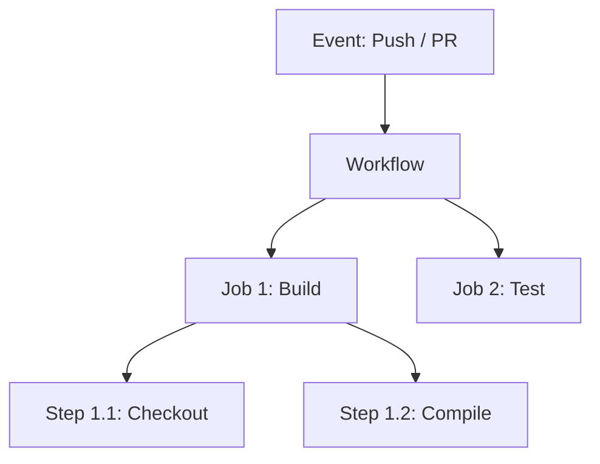

GitHub Actions makes it easy to automate all your software workflows, now with world-class CI/CD. Build, test, and deploy your code right from GitHub.

## Workflow Basics

Workflows are defined in YAML files located in the `.github/workflows` directory of your repository.



## Example Workflow

A simple workflow that runs tests on every push to the `main` branch.

```yaml .github/workflows/test.yml
name: Run Tests

on:
  push:
    branches: [ main ]
  pull_request:
    branches: [ main ]

jobs:
  test:
    runs-on: ubuntu-latest
    steps:
      - name: Checkout code
        uses: actions/checkout@v4

      - name: Set up Python
        uses: actions/setup-python@v5
        with:
          python-version: '3.11'

      - name: Install dependencies
        run: pip install -r requirements.txt

      - name: Run Pytest
        run: pytest
```

## Core Components

| Term | Description |
| :--- | :--- |
| **Workflow** | A configurable automated process consisting of one or more jobs. |
| **Event** | A specific activity that triggers a workflow (e.g., push, issue creation). |
| **Job** | A set of steps that execute on the same runner. |
| **Step** | An individual task that can run commands or actions. |
| **Action** | A standalone application that performs a complex but frequently repeated task. |
| **Runner** | A server that runs your workflows when they're triggered. |

## Best Practices

- **Use Secrets**: Store sensitive information (API keys, passwords) in GitHub Secrets and reference them as `${{ secrets.MY_SECRET }}`.
- **Cache Dependencies**: Use `actions/cache` to speed up your workflows by caching package manager dependencies.
- **Matrix Builds**: Test across multiple versions of languages or operating systems simultaneously using a strategy matrix.

<Tip>
  **Marketplace**: Before writing a complex script, check the **GitHub Marketplace** for pre-built actions that might already do what you need.
</Tip>
