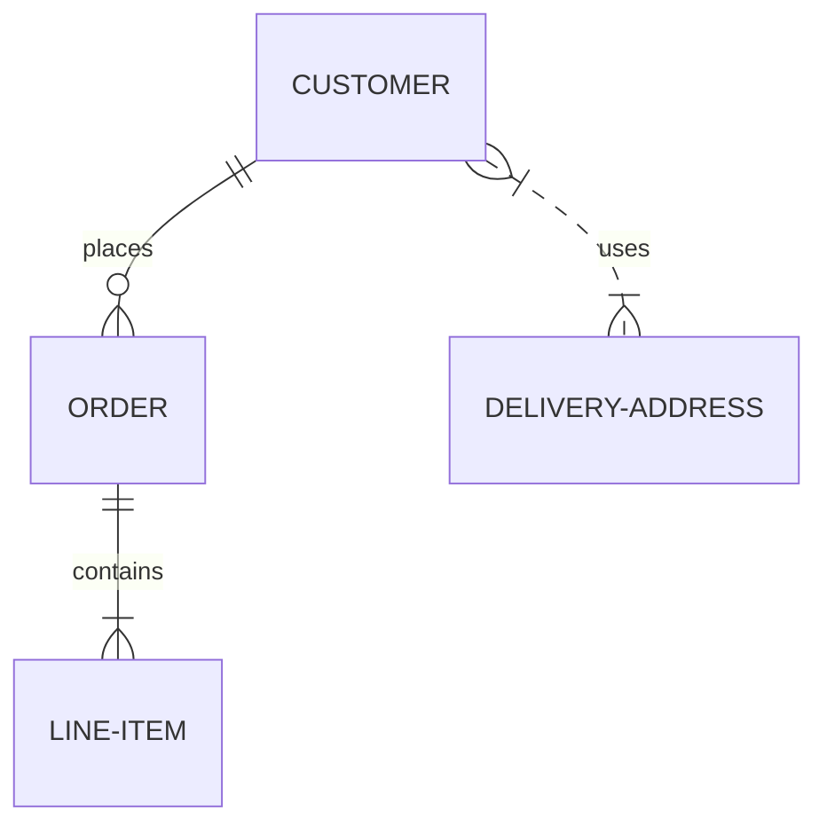
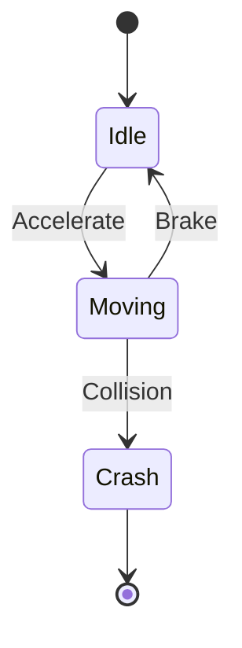
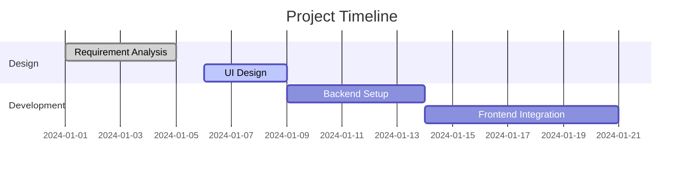

Mermaid is a powerful tool for creating complex diagrams using simple text syntax.

## Advanced Diagram Types

### 1. Entity Relationship Diagrams (ERD)
Perfect for documenting database schemas.

### 2. State Diagrams
Visualize complex logic and state transitions.

### 3. Gantt Charts
Track project timelines and milestones.

## Tips for Better Diagrams
- **Direction**: Use `graph TD` (Top-Down) or `graph LR` (Left-Right) to optimize layout.
- **Styling**: Customize colors and shapes using `classDef`.
- **Interactivity**: Add links to nodes for deeper navigation.
