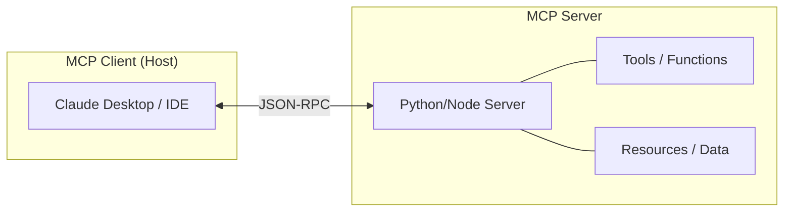

The Model Context Protocol (MCP) is an open standard that enables developers to build secure, two-way connections between their data sources and AI models.

## Core Architecture

MCP operates on a client-server model, where the client (like Claude Desktop) acts as the host and the server provides specific capabilities.



## Step-by-Step: Setting Up an MCP Server

1.  **Installation**:
    Ensure you have Node.js or Python installed.
2.  **Creating a Basic Server (Python)**:
    ```python
    from mcp.server.fastmcp import FastMCP

    # Initialize FastMCP
    mcp = FastMCP("MyServer")

    @mcp.tool()
    def get_weather(location: str) -> str:
        """Get the current weather for a location."""
        return f"The weather in {location} is sunny."

    @mcp.resource("config://settings")
    def get_config() -> str:
        """Expose a configuration resource."""
        return "api_key=12345"

    if __name__ == "__main__":
        mcp.run()
    ```
3.  **Configuring Claude Desktop**:
    Add your server to the client configuration file:
    - **macOS**: `~/Library/Application Support/Claude/claude_desktop_config.json`
    - **Windows**: `%APPDATA%\Claude\claude_desktop_config.json`

    ```json
    {
      "mcpServers": {
        "myserver": {
          "command": "python",
          "args": ["/path/to/your/server.py"]
        }
      }
    }
    ```
4.  **Verification**: Restart Claude Desktop and look for the 🔌 icon to confirm your tools are available.

## Advanced Usage

### Using Multiple Servers
You can connect multiple MCP servers simultaneously, allowing your AI model to cross-reference data from different sources (e.g., querying a database and then sending an email).

### Security & Privacy
MCP uses a capability-based security model. Servers only expose what is explicitly defined in tools and resources, and the client must approve every interaction.
